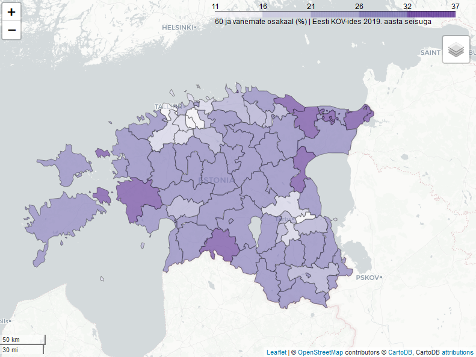

# 60 ja vanemate inimeste osakaal rahvastikust Eesti KOV-ides 2019. aasta seisuga

60-aastaste ja vanemate osakaal rahvastikust (%)

## Attribution

Tegija: Landscape Geoinformatics töörühm, Geograafia Osakond, Tartu Ülikool

Andmed: Eesti Statikaamet

Baaskaart: Leaflet, OpenStreetMap contributors, CartoDB
