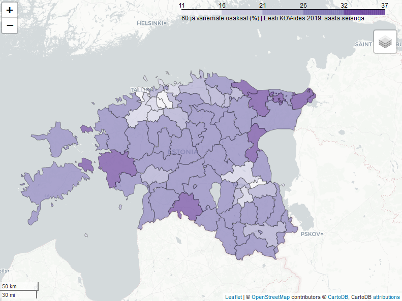

# 60 ja vanemate inimeste osakaal rahvastikust Eesti KOV-ides 2019. aasta seisuga

60-aastaste ja vanemate osakaal rahvastikust (%)

[https://landscapegeoinformatics.github.io/eesti_pop60plus/](https://landscapegeoinformatics.github.io/eesti_pop60plus/)

## Attribution

Tegija: Landscape Geoinformatics töörühm, Geograafia Osakond, Tartu Ülikool

[https://github.com/LandscapeGeoinformatics/eesti_pop60plus](https://github.com/LandscapeGeoinformatics/eesti_pop60plus)

Andmed: [Eesti Statikaamet](https://www.stat.ee/)

Baaskaart: Leaflet, OpenStreetMap contributors, CartoDB
